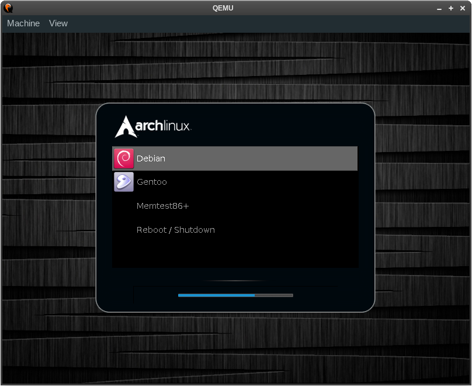
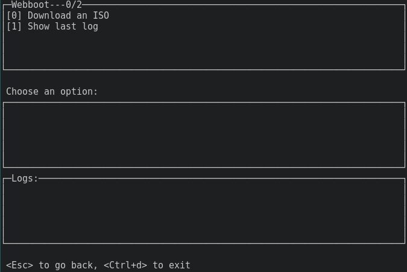
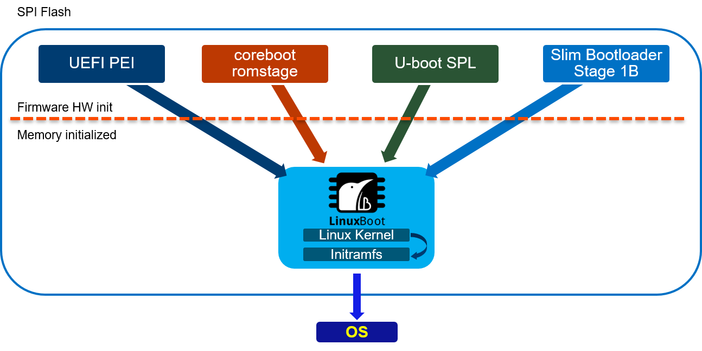
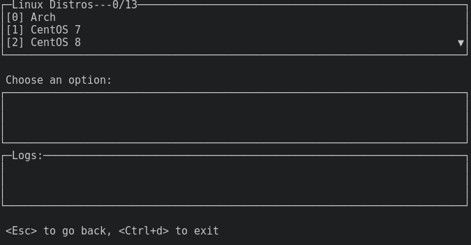

## Agenda

- Bootloaders
- What is webboot?
- Use-cases, Challenges, History
- Running From USB Storage

# Bootloaders

## Common Bootloader: GRUB

_A_ bootloader _is an application that loads and executes another application._

:::::::::::::: {.columns}
::: {.column width="55%"}
{ height=60% }
:::
::: {.column width="45%"}
- sometimes multiple stages (loaders) due to architecture
- target application may rely on a specific protocol
- often configurable via files or customizable at build time
- can offer an interactive menu, e.g. for switching OSs
:::
::::::::::::::

image source: [https://github.com/hartwork/grub2-theme-preview](
https://github.com/hartwork/grub2-theme-preview)

## Drivers, Parsers, Loaders

:::::::::::::: {.columns}
::: {.column width="35%"}
### Drivers 

- talk to hardware, e.g., graphics output
- abstract concepts, e.g., file systems
- may be provided by environment, such as UEFI DXE or Linux
:::
::: {.column width="30%"}

### Parsers

- understand data formats
- translate raw data to a usable form
- for configuration files and binaries
:::
::: {.column width="35%"}

### Loaders

- potentially pick up configuration
- load application to memory
- place additional data in memory and/or registers
:::
::::::::::::::

Eventually, tell the platform ("CPU") to execute from a specific memory address.

# What is webboot?

## webboot

webboot is a bootloader for distro images from the network, written in Go

{ height=80% }

## LinuxBoot Integration

webboot is built as a Linux application into an initramfs

[](https://linuxboot.org/)

# Use-cases, Challenges, History

## Why webboot?

There are many purposes for webboot, including:

- burner laptop; like Tails, but use _any_ distro
- try things out without installation
- volatile systems, such as CI runners
- development and testing
- system recovery and diagnostics

## How it started - how it's going

webboot was started and further developed by interns at Google

:::::::::::::: {.columns}
::: {.column width="35%"}
### before: CLI
```
dhclient -ipv6=false
webboot tinycore
```
:::
::: {.column width="65%"}
### after: TUI
{ height=80% }
:::
::::::::::::::

By now, ISOs are cached instead of downloading every single time, which is
just slow and not necessary if storage is available.

## pmem is nice, but

https://docs.pmem.io/persistent-memory/getting-started-guide/creating-development-environments/virtualization/qemu

- first concept with `pmem` driver (persistent aka non-volatile memory)
  * requires _contiguous_ memory, problematic across devices
  * requires target distro to include pmem driver, not always available
  * PMEM *must* be less than RAM so the system has memory to work with

---

```
qemu-system-x86_64 \
  -machine q35 -m 4G -serial stdio \
  -object rng-random,filename=/dev/urandom,id=rng0 \
  -device virtio-rng-pci,rng=rng0 \
  -netdev user,id=network0 -device rtl8139,netdev=network0 \
  -kernel $KERNEL -initrd $INITRD \
  -append "console=ttyS0 vga=786 memmap=$PMEM_OFFSET!$PMEM_SIZE"
```

# Running From USB Storage

## Build initramfs with u-root

:::::::::::::: {.columns}
::: {.column width="55%"}
_[u-root](https://u-root.org) is an initramfs cpio generator written in Go,
including BusyBox-like tooling and commands like `cat`._

### building
From the webboot source directory:

```sh
export GO111MODULE=off
go get github.com/u-root/u-root
go run .
```
:::
::: {.column width="45%"}
{ height=80% }
:::
::::::::::::::

## Legacy BIOS (MBR, UEFI CSM)

With syslinux, you can use [webboot from a USB stick](
https://github.com/u-root/webboot/#testing-with-a-usb-stick).

1. Build [u-root with webboot as an additional command](
https://github.com/u-root/webboot/#build-initramfs-with-added-webboot-commands)
2. Write a Volume Boot Record (VBR) to the stick
3. Write a Master Boot Record (MBR) to it
4. Mark the first partition as bootable
5. Copy the example syslinux config file, Linux kernel, and u-root initcpio

See the README at github.com/u-root/webboot for details.

# Thanks! :)
